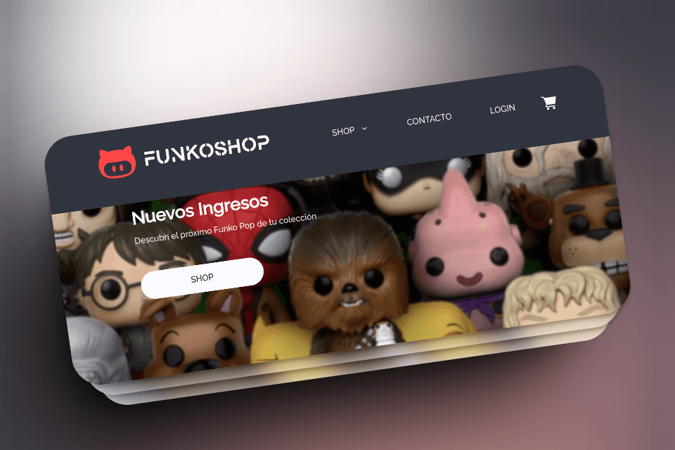

# Challenge Integrador :rocket:

## Grupo 10 del curso Fullstack Node.js del programa Codo a Codo 4.0

[Link al sitio](https://challenge-integrador-beige.vercel.app/shop/cart)

#### Tecnologías a utilizar

